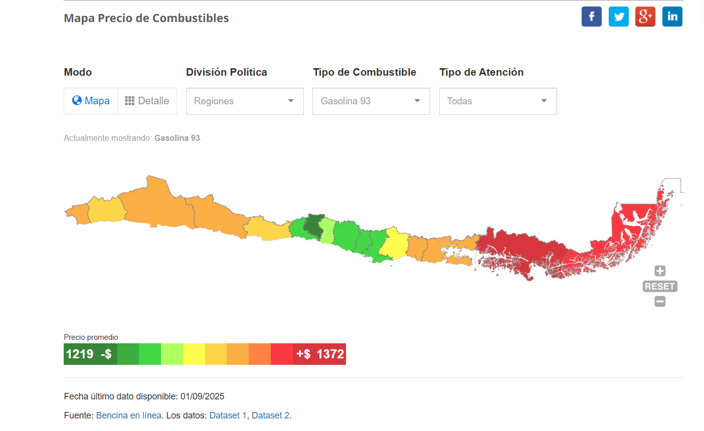
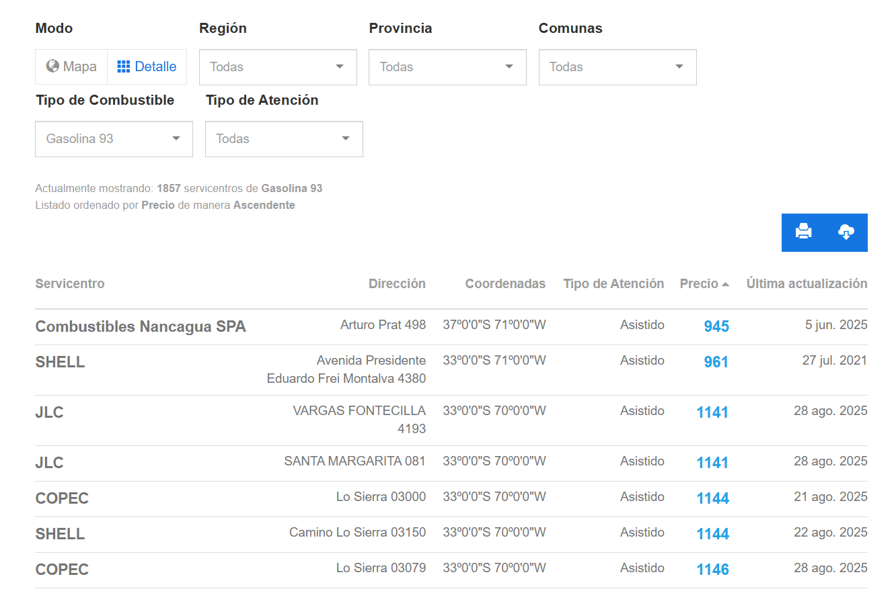

# VZ12 – Explorador de Precios de Combustibles

## 📌 Descripción

**VZ12** es un proyecto desarrollado en el contexto de la **Práctica Profesional II** en la  
**Comisión Nacional de Energía (CNE)**, cuyo objetivo fue **reactivar y modernizar el Explorador de Precios de Combustibles** del portal público **Energía Abierta**.

La herramienta había permanecido inactiva por cerca de **10 años**, debido a la obsolescencia del código y a cambios en la **API de Bencina en Línea** y en la **división político-administrativa de Chile**.

El proyecto permitió restablecer la visualización de precios de combustibles a nivel nacional, entregando información **actualizada, filtrable y de fácil comprensión para la ciudadanía**.

## 🚀 Funcionalidades principales

- Consumo de la **API de Bencina en Línea**
- **Mapa interactivo** con escala de colores según precio
- **Vista en tabla** con información detallada por servicentro
- Filtros dinámicos por:
  - Tipo de combustible (93, 95, 97, diésel, GLP, etc.)
  - Región, provincia y comuna
  - Tipo de atención (asistido / autoasistido)
- Actualización dinámica de datos en tiempo real
- Adaptación a la división territorial vigente en Chile

## 🛠️ Tecnologías utilizadas

- **Angular** – Framework principal del frontend
- **JavaScript** – Lógica de negocio y manipulación de datos
- **HTML / CSS** – Estructura y estilos
- **Postman** – Pruebas y validación de endpoints de la API
- **JSON** – Formato de intercambio de datos

## 🧠 Desafíos técnicos abordados

- Adaptación de una aplicación obsoleta a una **nueva versión de API**
- Normalización de campos con estructuras distintas
- Manejo de datos geográficos y territoriales
- Implementación de filtros que afectan múltiples vistas simultáneamente
- Reconstrucción de una herramienta pública sin documentación previa actualizada

## 📸 Capturas de pantalla

### Mapa interactivo

### Vista en tabla

## 📊 Resultado

El resultado final fue un **visualizador completamente funcional**, con doble modo de consulta (mapa y tabla), capaz de mostrar precios de combustibles de manera clara, actualizada y consistente.

La herramienta contribuye directamente a la **transparencia y acceso a información pública**, permitiendo a los usuarios comparar precios y tomar decisiones informadas.

## 📌 Contexto académico

Este proyecto fue desarrollado como parte de la:

- **Práctica Profesional II**
- Carrera: Ingeniería Civil en Computación
- Universidad de Chile – Departamento de Ciencias de la Computación
- Institución: Comisión Nacional de Energía (CNE)

---

## 📌 Estado del proyecto

🟢 Funcional – Proyecto académico aplicado a un entorno real de servicio público.

---

## 👤 Autor

**Cristian Fuentes Gutiérrez**  
Ingeniería Civil en Computación – Universidad de Chile  

GitHub: https://github.com/CristianIgnacio
